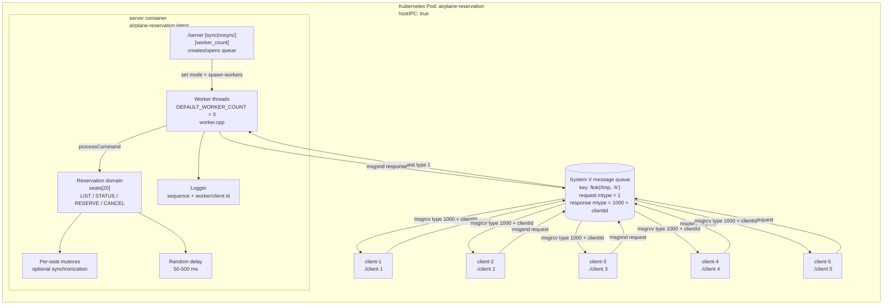
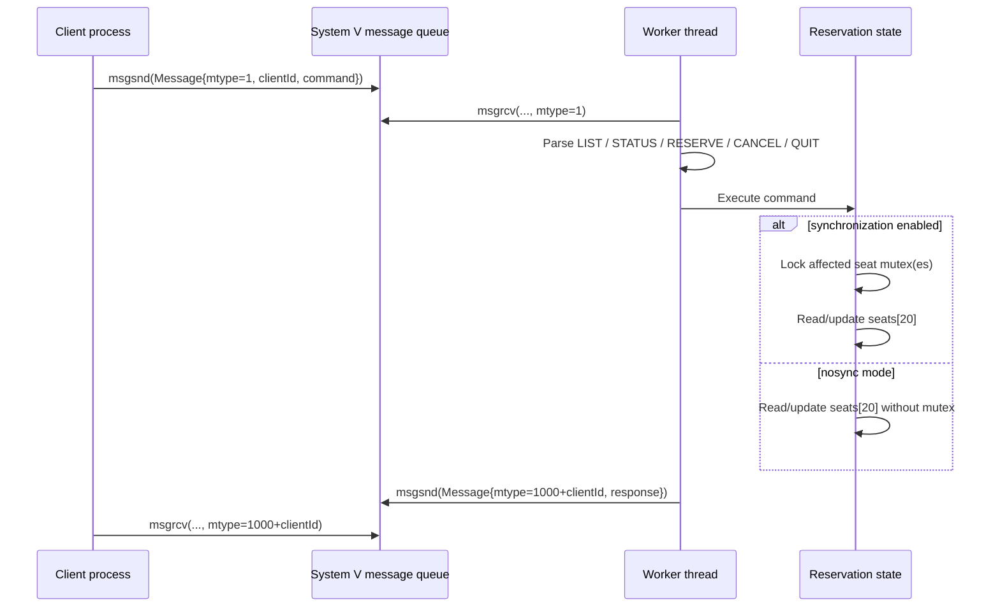

# Current Architecture

เอกสารนี้สรุป architecture จากโค้ดและ manifest ที่มีอยู่ใน repository ณ วันที่ 2026-09-10

## Overview



## Request flow



## Message contract

```text
struct Message {
    long mtype;       // System V routing type
    int  clientId;    // response destination and reservation owner
    char command[128];
    char response[2048];
};
```

Requests use `mtype = 1`. A worker responds with `mtype = 1000 + clientId`, allowing each client to read only its own response from the shared queue.

## Components and responsibilities

| Component | Responsibility | Source |
| --- | --- | --- |
| `server` | Creates/opens the queue, configures sync mode, and spawns the worker pool | `src/server/server.cpp`, `k8s/pod.yaml` |
| Worker pool | Consumes request messages, dispatches commands, sends responses | `src/server/worker.cpp` |
| Reservation domain | In-memory seat state, validation, reserve/cancel/status/list operations | `src/reservation/reservation.cpp` |
| Synchronization | One `std::mutex` per seat when enabled | `src/reservation/reservation.cpp` |
| Message contract | Fixed-size request/response payload and message types | `src/models/message.h`, `src/constants/constants.h` |
| Logger | Serialized console logs with sequence number | `src/utils/logger.cpp` |
| Delay | Simulates 50–500 ms operation delay | `src/utils/delay.cpp` |
| CLI parser | Validates positive integer arguments shared by server and client | `src/utils/cli_parser.cpp` |
| Clients | Command-line clients that send commands and wait for per-client responses; five Kubernetes containers are provisioned | `src/client/client.cpp`, `k8s/pod.yaml` |
| Load test | Concurrently sends `STATUS` requests and measures throughput/latency | `src/load_test/load_test.cpp` |

## Current-state notes

- Seat state is in the server process memory (`seats[20]`); there is no database or persistent storage.
- All workers in the server process share the same seat array and per-seat mutexes.
- Clients communicate through the same System V queue. Responses are routed by `1000 + clientId`.
- The Kubernetes manifest creates one Pod with one server container and five client containers, and sets `hostIPC: true`; client containers wait for a manual `kubectl exec` command.
- The server supports `sync` or `nosync` plus a configurable worker count; the default is synchronized mode with 3 workers.
- The manifest starts the server with `nosync 3`, so the default Kubernetes path is the unsynchronized branch for the race-condition demo.
- `client.cpp` and `server.cpp` implement the executable entrypoints, including queue creation/access and request/response handling.
- `Dockerfile` copies `Makefile`, `src/`, and `scripts/` into the image before running `make`.
- `Makefile` builds `server`, `client`, and `load_test`.
- `load_test` sends concurrent `STATUS` requests and reports success rate, throughput, and average latency.

## Key constants

- 20 seats
- 3 default worker threads
- Request message type `1`
- Response message type `1000 + clientId`
- Queue key source `/tmp` with project id `'A'`
- Simulated delay between 50 and 500 ms
