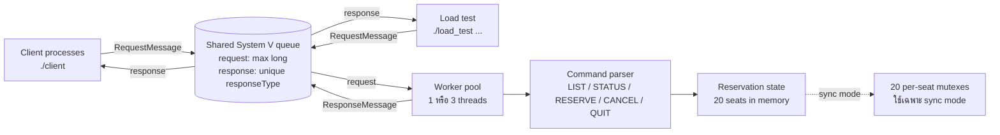
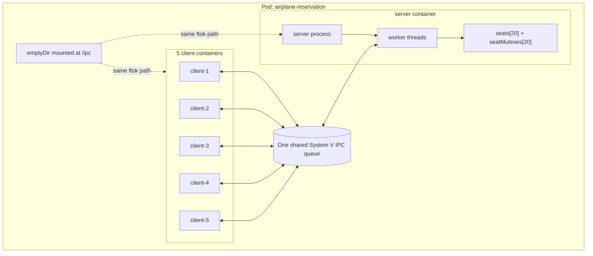
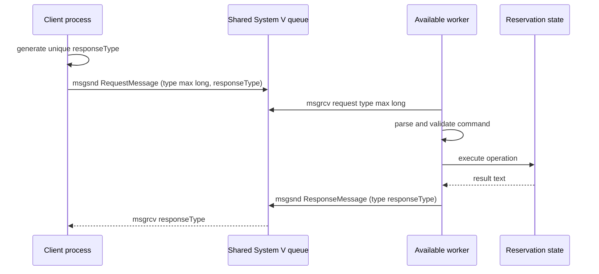
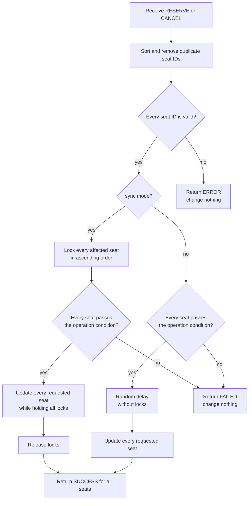

# Architecture ของ Airplane Reservation System

เอกสารนี้อธิบายโครงสร้างของระบบตาม implementation ปัจจุบัน โดยเริ่มจากภาพรวมก่อน แล้วค่อยลงรายละเอียดเรื่อง message queue, worker, synchronization, transaction และการรันบน Kubernetes

## 1. ภาพรวมแบบสั้น

ระบบแบ่งเป็น 3 ส่วนหลัก:

1. `client` หรือ `load_test` สร้างคำสั่งและส่ง request
2. System V message queue รับส่งข้อมูลระหว่าง process
3. `server` มี worker threads หลายตัวคอยประมวลผล และใช้ข้อมูลที่นั่งชุดเดียวกันใน memory



ข้อมูลที่นั่งไม่ได้อยู่ใน database และไม่ถูกเขียนลงไฟล์ เมื่อ server หรือ Pod หยุด ข้อมูลทั้งหมดจะหายไป

## 2. Runtime topology บน Kubernetes

manifest ทั้ง 3 ไฟล์สร้าง Pod ชื่อ `airplane-reservation` ที่มี 6 containers:

- 1 server container รัน `./server <mode> <worker_count>`
- 5 client containers รัน `sleep infinity` เพื่อรอให้เรียก `client` หรือ `load_test` ผ่าน `kubectl exec`

ทุก container ใช้ image `airplane-reservation:latest` ชุดเดียวกัน



`/ipc` เป็น `emptyDir` ภายใน Pod และถูก mount เข้าไปในทุก container ทำให้ทุก process เรียก `ftok("/ipc", 'A')` แล้วหา queue เดียวกันได้ ระบบไม่ใช้ `hostIPC: true` จึงไม่เปิด IPC namespace ของ host ให้ Pod และ queue ไม่ไปรวมกับ Pod อื่นบน node

## 3. Request และ response เดินทางอย่างไร

client หนึ่งตัวจะส่งทีละคำสั่ง แล้วรอ response ของคำสั่งนั้นก่อนอ่านคำสั่งถัดไป



worker ทุกตัวอ่านเฉพาะ request type ค่าสูงสุดของ `long` จาก queue เดียวกัน ดังนั้น request แต่ละรายการจะถูกหยิบไปทำโดย worker ที่ว่างอยู่ ส่วน client สร้าง `responseType` เฉพาะต่อคำสั่งจาก process ID และ sequence number แล้ว worker จะส่ง response กลับเข้า queue เดิมด้วย type นั้น จึงแยกคำตอบได้แม้หลาย process ใช้ client ID ซ้ำ การกำหนด request type ให้อยู่เหนือ response ทุกประเภท ทำให้ worker สามารถค้นหาและล้าง response ที่หมดอายุได้โดยไม่ต้องนำ request ออกจาก queue

### Message contract

```cpp
struct RequestMessage {
    long mtype;
    int clientId;
    long responseType;
    int64_t responseDeadlineEpochMs;
    char command[128];
};

struct ResponseMessage {
    long mtype;
    int clientId;
    int64_t responseDeadlineEpochMs;
    char response[2048];
};
```

request และ response ใช้ struct คนละแบบแต่เดินทางผ่าน queue เดียวกัน โดยแยกด้วย message type: worker รับเฉพาะ request type และ client รับเฉพาะ `responseType` ของตัวเอง เพื่อป้องกัน deadlock เมื่อ queue อิ่ม worker จะเก็บ response ที่ส่งไม่ได้ไว้ใน memory ชั่วคราว (สูงสุด 256 รายการต่อ worker) แล้วรับ request ต่อเพื่อสร้างพื้นที่ ก่อน retry ส่ง response แบบ non-blocking. request จะพก deadline 10 วินาที และ worker จะทิ้ง response ที่หมดอายุทั้งจาก pending memory และ shared queue เพื่อไม่ให้ client ที่ timeout ทำให้ queue ค้างเต็ม หาก timeout หลังส่ง request ผลของ operation ยังไม่แน่นอนและต้องตรวจ STATUS ก่อน retry

## 4. Server และ worker pool

เมื่อ server เริ่มทำงาน จะทำตามลำดับนี้:

1. อ่าน mode (`sync` หรือ `nosync`) และจำนวน worker
2. ขอ exclusive `flock` บน `/ipc/server.lock`; ถ้ามี server อยู่แล้วให้หยุดโดยไม่แตะ queue เดิม
3. สร้าง key ด้วย `ftok("/ipc", 'A')` และลบเฉพาะ queue ที่ค้างหลังได้ lock แล้ว
4. สร้าง request queue ใหม่และตั้งค่า synchronization
5. block `SIGINT`/`SIGTERM` ก่อนสร้าง threads เพื่อให้ main รับผ่าน `sigwait`
6. สร้าง worker threads ตามจำนวนที่กำหนด (1–64)
7. worker รับ request, ประมวลผล และส่งคำตอบกลับเข้า shared queue แบบ non-blocking

เมื่อ server ได้รับ `SIGINT` หรือ `SIGTERM` จะลบ request queue แล้ว join workers ก่อนปิด process และคืน server lock ส่วน worker จะออกจาก loop เมื่อ queue ถูกลบและ `msgrcv` คืน `EIDRM` หรือ `EINVAL`

จำนวน worker มีผลต่อ concurrency โดยตรง:

- 1 worker: ทำคำสั่งทีละรายการ แม้ clients จะส่งพร้อมกัน
- มากกว่า 1 worker: หลายคำสั่งเข้าถึง reservation state พร้อมกันได้

## 5. ข้อมูลที่นั่งและคำสั่ง

ข้อมูลหลักคือ array ขนาด 20 ช่อง:

```text
seats[index] = 0          หมายถึงที่นั่งว่าง
seats[index] = clientId   หมายถึง client นั้นเป็นเจ้าของที่นั่ง
```

seat ID ที่ผู้ใช้เห็นอยู่ในช่วง `1-20` ส่วน index ภายใน array อยู่ในช่วง `0-19`

| คำสั่ง | การทำงาน | เงื่อนไขสำคัญ |
| --- | --- | --- |
| `LIST` | แสดงสถานะครบ 20 ที่นั่ง | ไม่รับ argument |
| `STATUS <seat>` | แสดงสถานะหนึ่งที่นั่ง | ต้องมี seat ID เพียงตัวเดียว |
| `RESERVE <seat...>` | จองหนึ่งหรือหลายที่นั่ง | ทุกที่นั่งต้อง valid และว่าง |
| `CANCEL <seat...>` | ยกเลิกหนึ่งหรือหลายที่นั่ง | ทุกที่นั่งต้องเป็นของ client ที่ส่งคำสั่ง |
| `QUIT` | ส่ง `GOODBYE` แล้ว client จบการทำงาน | ไม่รับ argument |

เลขที่นั่งซ้ำใน `RESERVE` หรือ `CANCEL` จะถูก sort และตัดค่าซ้ำก่อนประมวลผล เช่น `RESERVE 3 1 3` จะทำงานกับที่นั่ง `1` และ `3`

## 6. Multi-seat transaction

`RESERVE` และ `CANCEL` รองรับหลายที่นั่งในคำสั่งเดียว และใช้แนวคิด all-or-nothing สำหรับ conflict ที่ตรวจพบ:



ตัวอย่าง: ถ้า Client-1 ส่ง `RESERVE 4 5 6` แต่ที่นั่ง 5 ถูกจองอยู่แล้ว ระบบจะไม่จอง 4 และ 6 ให้บางส่วน แต่จะยกเลิกทั้งคำสั่ง

การ lock ตามลำดับ seat ID จากน้อยไปมากทำให้ transaction ที่ขอหลายที่นั่งใช้ลำดับ lock เหมือนกัน และหลีกเลี่ยง deadlock จากการถือ mutex ไขว้กัน

## 7. ความต่างระหว่าง sync และ nosync

| ประเด็น | `sync` | `nosync` |
| --- | --- | --- |
| การเข้าถึง seat state | ใช้ mutex แยกต่อที่นั่ง | ไม่ใช้ mutex |
| Check และ update | อยู่ภายใต้ locks ชุดเดียวกัน | มี random delay คั่นระหว่าง check กับ update |
| เมื่อหลาย worker จองที่เดียวกัน | สำเร็จได้เพียงหนึ่ง request | หลาย request อาจคิดว่าสำเร็จพร้อมกัน |
| Multi-seat conflict ที่มีอยู่ก่อน | ยกเลิกทั้งคำสั่ง | ยกเลิกทั้งคำสั่ง |
| Atomic เมื่อมี concurrent request | ใช่ สำหรับที่นั่งที่ lock | ไม่ใช่ |
| จุดประสงค์ | แสดงการแก้ race condition | แสดงผลของ race condition |

จุดสำคัญคือ `nosync` ทำ pre-check ครบทุกที่นั่งก่อน update จึงไม่เกิด partial update เมื่อพบ conflict ที่มีอยู่แล้ว แต่ไม่สามารถรับประกัน atomicity ระหว่าง concurrent requests ได้ เพราะ state อาจเปลี่ยนหลัง pre-check และก่อน update

```mermaid
sequenceDiagram
    participant A as Worker A / Client-1
    participant State as Seat 10
    participant B as Worker B / Client-2

    A->>State: check: AVAILABLE
    B->>State: check: AVAILABLE
    Note over A,B: random delay; no mutex in nosync mode
    A->>State: set owner = Client-1
    B->>State: set owner = Client-2
    Note over A,B: both requests may report SUCCESS; last write remains in memory
```

ใน `sync` worker ตัวแรกจะถือ mutex ของ Seat 10 ตั้งแต่ check จน update เสร็จ Worker อีกตัวจึงต้องรอ และจะพบว่าที่นั่งไม่ว่างหลังได้ lock

## 8. การทดลองทั้ง 3 แบบ

topology ของทั้ง 3 experiments เหมือนกันทั้งหมด ต่างกันเฉพาะ argument ของ server:

| Experiment | Manifest | Server configuration | สิ่งที่ต้องสังเกต |
| --- | --- | --- | --- |
| 1. Sequential baseline | `k8s/pod-sequential.yaml` | `sync 1` | ทุก request ทำทีละรายการ จึงไม่มีการชนกันระหว่าง workers |
| 2. Concurrent without synchronization | `k8s/pod.yaml` | `nosync 3` | มี 3 workers และไม่มี mutex จึงสามารถเห็น race condition |
| 3. Concurrent with synchronization | `k8s/pod-sync.yaml` | `sync 3` | มี 3 workers แต่ mutex ทำให้การจองที่นั่งเดียวกันสำเร็จเพียงหนึ่ง request |

`scripts/concurrent-test.sh` ส่ง `RESERVE 10` จาก client 1-5 พร้อมกัน เพื่อใช้ workload เดียวกันเปรียบเทียบทั้ง 3 configurations พร้อมทั้งแสดง client responses และ live server logs แยก prefix ให้ดูง่าย

`scripts/demo1.sh` ใช้ client 1–5 ส่งหลายคำสั่งต่างชุดพร้อมกัน โดยแต่ละ client จองและยกเลิกที่นั่งของตัวเอง ทั้งสอง script เก็บหลักฐานแยกแต่ละรอบใน `results/` และรองรับ `RUNTIME=k8s`, `docker`, `local`

## 9. Load test

`load_test` ใช้ message queue เดียวกับ client ปกติ แต่ใช้ thread pool ตามค่า concurrency แต่ละ request ใช้ client ID (`10000 + requestNumber`) สำหรับ ownership และสร้าง `responseType` เฉพาะเพื่อรับคำตอบกลับจาก shared queue

รองรับ operations ต่อไปนี้:

- `STATUS`
- `RESERVE`
- `CANCEL`

ถ้าไม่ระบุ seat ID ระบบจะวนเลือกที่นั่ง 1-20 แบบ round-robin ถ้าระบุ seat ID ทุก request จะยิงไปที่ที่นั่งเดียวกันเพื่อสร้าง contention

ผลลัพธ์ที่รายงานประกอบด้วย completed requests, transport failures, operation successes/failures, completion rate, throughput และ average latency

## 10. Logs และผลลัพธ์ของ client

ข้อมูลสองส่วนนี้มาจากคนละ stream:

- server logs แสดงลำดับเหตุการณ์ภายใน worker เช่น check, wait for lock, lock, update และออกจาก critical section
- client output คือ response ที่ worker ส่งกลับผ่าน message queue

logger ใช้ mutex ของตัวเองเพื่อไม่ให้ข้อความจากหลาย workers เขียนทับกัน และใส่ sequence number, worker ID และ client ID ในแต่ละบรรทัด:

```text
[SEQ 12] [Worker-2] [Client-4] locked Seat 10
```

sequence number บอกลำดับที่ log ถูกพิมพ์ ไม่ได้หมายความว่าทุก operation ทำงานแบบ sequential

## 11. Tests และสิ่งที่แต่ละระดับตรวจ

| ระดับ | ไฟล์/คำสั่ง | ขอบเขต |
| --- | --- | --- |
| Unit | `tests/unit_tests.cpp`, `make test-unit` | parser, validation, ownership, duplicate seats, rollback และ concurrency ของ reservation module |
| Integration | `tests/integration_tests.sh`, `make test-integration` | executable จริง, System V queue, commands, queue lifecycle, ทั้ง 3 modes และ load test |
| Kubernetes smoke | `tests/k8s_smoke_tests.sh`, `make test-k8s` | manifests ทั้ง 3 แบบ, command lifecycle และ load test ภายใน Pod |

`make test` รัน unit, IPC, integration และ regression tests รวมการตรวจ script error/quoting และ build dependency ส่วน Kubernetes test แยกเป็น `make test-k8s` เพราะต้องมี Docker Desktop Kubernetes และ image `airplane-reservation:latest` อยู่ก่อน

## 12. Component map

| Component | หน้าที่ | Source |
| --- | --- | --- |
| Server entrypoint | ตั้ง mode, จัดการ queue lifecycle และสร้าง workers | `src/server/server.cpp` |
| Worker | รับ request, parse command และส่ง response | `src/server/worker.cpp` |
| Reservation | เก็บ seat state และทำ LIST/STATUS/RESERVE/CANCEL | `src/reservation/reservation.cpp` |
| Client | อ่านคำสั่งจาก stdin และรอ response ของตัวเอง | `src/client/client.cpp` |
| Load test | สร้าง concurrent requests และวัดผล | `src/load_test/load_test.cpp` |
| Message model | กำหนด request/response payload | `src/models/message.h` |
| Constants | จำนวนที่นั่ง, message types, queue key และ delay | `src/constants/constants.h` |
| IPC | queue ownership, request/reply, timeout และ server lock | `src/ipc/` |
| CLI parser | ตรวจ integer tokens และ command arguments | `src/utils/cli_parser.cpp` |
| Logger | serialize logs และสร้าง sequence number | `src/utils/logger.cpp` |
| Delay | สุ่ม delay 50-500 ms เพื่อขยาย race window | `src/utils/delay.cpp` |
| Kubernetes manifests | กำหนด Pod topology และ experiment mode | `k8s/` |

## 13. ค่าคงที่สำคัญ

| ค่า | ปัจจุบัน |
| --- | --- |
| จำนวนที่นั่ง | 20 |
| จำนวน worker เริ่มต้น | 3 |
| Request message type | ค่าสูงสุดของ `long` |
| Response message type | `responseType` เฉพาะคำสั่ง (`1000 + process ID × 1,048,576 + sequence`) |
| Queue key | `ftok("/ipc", 'A')` |
| Random delay | 50-500 ms |
| สถานะว่างภายใน array | `0` |

## 14. ข้อจำกัดของ architecture ปัจจุบัน

- มี server process และ Pod เดียว ไม่มี replication หรือ failover
- seat state อยู่ใน memory จึงไม่ทนต่อการ restart
- System V message queue เป็น IPC ภายในเครื่อง/Pod ไม่ใช่ network service
- client ID เป็นตัวเลขที่ผู้เรียกกำหนดเอง ไม่มี authentication
- `nosync` จงใจไม่ปลอดภัยต่อ concurrent updates และใช้เพื่อการทดลองเท่านั้น
- client ที่ถูก SIGKILL อาจทิ้ง response ไว้ใน shared queue จน server ลบ queue ตอน shutdown/restart
- source/message contract เปลี่ยนแล้วต้อง rebuild server และ clients พร้อมกัน
- response มีขนาดคงที่ 2048 bytes จึงเหมาะกับจำนวนที่นั่งปัจจุบัน แต่ไม่ได้ออกแบบไว้สำหรับข้อมูลขนาดใหญ่
