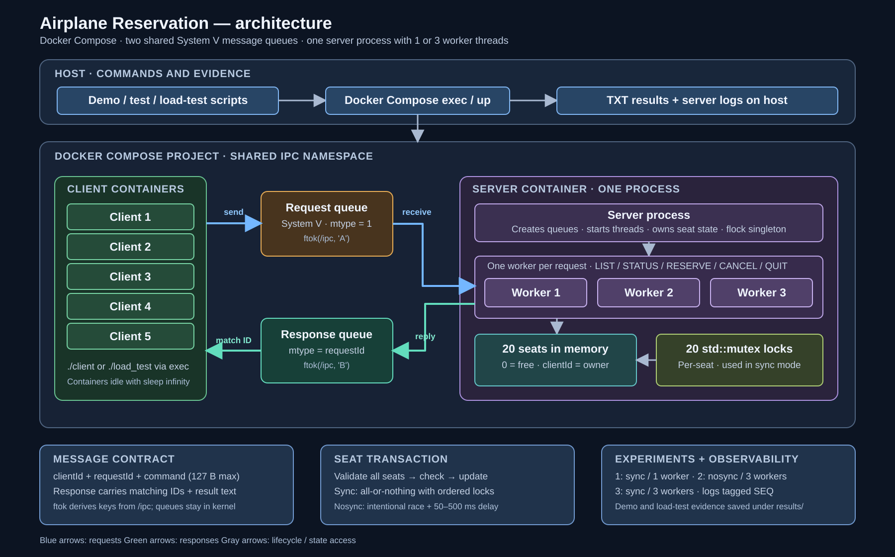

# System Architecture

เอกสารนี้อธิบายระบบจองที่นั่งตาม implementation ปัจจุบัน รวมการสื่อสารผ่าน System V message queues, การจัดการ transaction, worker synchronization และการรัน services ด้วย Docker Compose

## ภาพรวม

ภาพนี้แยก client 1–5, request queue, response queue, server process และ worker 1–3 ให้เห็นชัด: workers รับงานจาก request queue ร่วมกัน และส่งคำตอบเข้า response queue เพื่อให้ client รับคำตอบที่ตรงกับ `requestId`

Experiment 1 ใช้ worker 1 ตัว; Experiment 2 และ 3 ใช้ worker 3 ตัว สถานะที่นั่ง 20 ที่อยู่ใน memory ของ server process และมี per-seat mutex เฉพาะโหมด sync

Client containers และ server ใช้ IPC namespace ร่วมกัน ส่วน named volume ที่ `/ipc` มีไว้ให้ `ftok` สร้าง queue keys เท่านั้น ไม่ได้เก็บ queue หรือสถานะการจอง

## Compose topology

ไฟล์ `compose/compose.yaml` กำหนด service `server` และ client services 5 ตัว แต่ละ client รอคำสั่งจาก `docker compose exec`:

| Compose service | Process |
| --- | --- |
| `server` | `./server nosync 3` ตามค่าเริ่มต้น |
| `client-1` ถึง `client-5` | `sleep infinity` เพื่อรอรับ client/load-test process |

Server ใช้ IPC namespace แบบ `shareable`; clients ใช้ namespace เดียวกับ server ผ่าน `ipc: service:server`. ทุก service mount named volume เดียวกันที่ `/ipc`, ซึ่งเป็น path ที่ `ftok` ใช้สร้าง key ของ queues และ semaphore

การแบ่ง IPC namespace ของ Compose project ทำให้ System V queues ไม่ปะปนกับ host หรือ Compose project อื่น

### Experiment configurations

Compose overlays เปลี่ยนเฉพาะ server command:

| Experiment | Configuration | Server command |
| --- | --- | --- |
| Sequential baseline | `compose/compose.sequential.yaml` | `./server sync 1` |
| Concurrent without synchronization | `compose/compose.yaml` | `./server nosync 3` |
| Concurrent with synchronization | `compose/compose.sync.yaml` | `./server sync 3` |

`scripts/compose.sh` เลือก overlay จาก `COMPOSE_EXPERIMENT`. เมื่อต้องการเปลี่ยนรูปแบบ ให้หยุด services แล้วเริ่มใหม่เพื่อให้ได้ server และ IPC state ชุดใหม่

## Message flow

1. Client สร้าง `requestId` และส่ง message ไปยัง shared request queue
2. Worker ตัวใดตัวหนึ่งรับ request แล้วประมวลผล operation
3. Server ส่ง response เข้า shared response queue โดยใช้ `requestId` เป็น message type สำหรับ routing
4. Client อ่าน response ที่ตรงกับ request ของตัวเอง

Request และ response แยกคนละ queue; response ไม่ย้อนกลับเข้า request queue และไม่ต้องมี private queue ต่อ client

## Message data

Message มีข้อมูลสำหรับแยกชนิดกับ route งาน:

| Field | Purpose |
| --- | --- |
| `mtype` | System V queue message type; response ใช้ request ID เพื่อให้ client รับ response ของตน |
| `clientId` | ระบุ client และใช้ตรวจ ownership ของ reservation |
| `requestId` | ระบุ request ที่ไม่ซ้ำกันและจับคู่ response |
| `command` | ข้อความคำสั่ง เช่น `RESERVE 3 4` หรือ `STATUS 3` |
| `response` | ข้อความผลการทำงานที่ส่งกลับ client |

รายละเอียดโครงสร้างจริงอยู่ใน `src/models/message.h`; การ parse คำสั่งเป็น operation และ seat IDs เกิดหลังจาก worker รับ request

## Reservation transaction

การจองหรือยกเลิกหลายที่นั่งทำงานแบบ all-or-nothing:

1. ตรวจ syntax และ validate ที่นั่งทั้งหมดก่อนเปลี่ยน state
2. ในโหมด sync ล็อกที่นั่งตามลำดับที่แน่นอนเพื่อลด deadlock
3. ตรวจ availability หรือ ownership ของทุกที่นั่ง
4. หากมีรายการใดไม่ผ่าน ให้ยกเลิก transaction และไม่เปลี่ยนรายการใด
5. หากผ่านทั้งหมด จึง commit state ของทุกที่นั่ง
6. ปลด locks และส่งผลกลับ client

โหมด nosync ตั้งใจข้าม mutex เพื่อให้เห็น race condition ในการทดลอง

## Load test และหลักฐาน

`load_test` ใช้ thread pool ตาม concurrency ที่กำหนด ส่ง `STATUS`, `RESERVE` หรือ `CANCEL` และรายงาน completed requests, transport failures, operation outcomes, throughput และ average latency

PowerShell wrapper `scripts/load-test.ps1` เรียก Compose client service และบันทึก output, server logs และ parameters/exit codes เป็นไฟล์ TXT ใน directory แยกต่อรอบ

Demo scripts เก็บ commands และ output แยกตาม client พร้อม live/final server logs ใน `results/demos/<demo>/<UTC timestamp>/`. Load-test และ test suites ก็แยก directory ตามประเภท ดูรายการไฟล์ทั้งหมดได้ที่ `results/README.md`; CI อัปโหลดผลเหล่านี้เป็น artifact

## Repository map

| Path | Responsibility |
| --- | --- |
| `src/client/` | รับคำสั่งผู้ใช้ ส่ง request และรับ response |
| `src/server/` | สร้าง queues, worker threads และประมวลผล requests |
| `src/ipc/` | System V queue wrappers และป้องกัน server ซ้ำ |
| `src/reservation/` | seat state, validation, transaction และ synchronization |
| `src/load_test/` | concurrent load generator และ throughput/latency summary |
| `src/utils/` | CLI parser, logger และ delay utilities |
| `compose/` | runtime topology และ experiment configurations |
| `scripts/` | Compose wrapper, demos, concurrent test และ result collection |
| `tests/` | unit, IPC, integration, regression, script และ Compose smoke tests |
