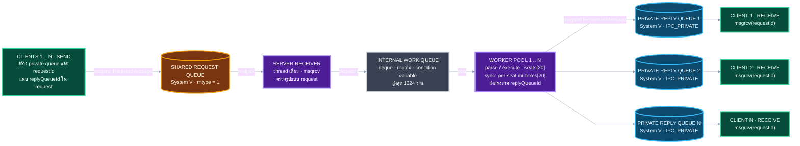

# System Architecture

ระบบจองที่นั่งรันบน Linux ใน Docker container เดียว `./server` เป็น process หลัก และ `./client` แต่ละตัวเป็น process ที่เปิดด้วย `docker exec` ทุก process ใช้ IPC namespace เดียวกัน ที่นั่ง 20 ที่และ worker threads อยู่ใน memory ของ server

## ภาพรวมระบบ: จากคำขอถึงคำตอบ

```mermaid
%%{init: {"theme": "base", "flowchart": {"curve": "linear", "nodeSpacing": 55, "rankSpacing": 55}, "themeVariables": {"background": "#111827", "primaryTextColor": "#f8fafc", "lineColor": "#94a3b8", "fontFamily": "Arial"}}}%%
flowchart LR
    SEND["CLIENTS 1 .. N · SEND<br/>สร้าง private queue และ requestId<br/>แนบ replyQueueId ใน request"]
    REQUEST[("SHARED REQUEST QUEUE<br/>System V · mtype = 1")]
    RECEIVER["SERVER RECEIVER<br/>thread เดียว · msgrcv<br/>ตรวจรูปแบบ request"]
    WORK_QUEUE["INTERNAL WORK QUEUE<br/>deque · mutex · condition variable<br/>สูงสุด 1024 งาน"]
    WORKERS["WORKER POOL 1 .. N<br/>parse / execute · seats[20]<br/>sync: per-seat mutexes[20]<br/>ส่งตรงตาม replyQueueId"]
    Q1[("PRIVATE REPLY QUEUE 1<br/>System V · IPC_PRIVATE")]
    Q2[("PRIVATE REPLY QUEUE 2<br/>System V · IPC_PRIVATE")]
    QN[("PRIVATE REPLY QUEUE N<br/>System V · IPC_PRIVATE")]
    C1["CLIENT 1 · RECEIVE<br/>msgrcv(requestId)"]
    C2["CLIENT 2 · RECEIVE<br/>msgrcv(requestId)"]
    CN["CLIENT N · RECEIVE<br/>msgrcv(requestId)"]

    SEND -->|"msgsnd RequestMessage"| REQUEST
    REQUEST -->|msgrcv| RECEIVER
    RECEIVER -->|dispatch| WORK_QUEUE
    WORK_QUEUE -->|pop| WORKERS
    WORKERS -->|"msgsnd ResponseMessage"| Q1
    WORKERS --> Q2
    WORKERS --> QN
    Q1 --> C1
    Q2 --> C2
    QN --> CN

    classDef server fill:#4c1d95,stroke:#a78bfa,color:#faf5ff,stroke-width:3px
    classDef request fill:#78350f,stroke:#f59e0b,color:#fffbeb,stroke-width:3px
    classDef internal fill:#374151,stroke:#d1d5db,color:#f9fafb,stroke-width:3px
    classDef reply fill:#0c4a6e,stroke:#38bdf8,color:#f0f9ff,stroke-width:3px
    classDef client fill:#064e3b,stroke:#34d399,color:#ecfdf5,stroke-width:3px
    class RECEIVER,WORKERS server
    class REQUEST request
    class WORK_QUEUE internal
    class Q1,Q2,QN reply
    class SEND,C1,C2,CN client
```

กล่อง **SEND** และ **RECEIVE** คือคนละช่วงของ client process เดียวกัน ไม่ใช่ client สองชุด Client 1, 2 และ N ส่งคำขอผ่าน shared request queue เดียว แต่แต่ละตัวสร้าง private reply queue ของตนเอง เมื่อ Worker ทำงานเสร็จจะเลือก **เพียงคิวเดียว** จาก `replyQueueId` ใน request แล้วส่งคำตอบตรงเข้าคิวนั้น เส้นจาก Worker ไป Queue 1, 2 และ N จึงแสดงทางเลือก ไม่ใช่การส่งคำตอบเดียวไปทุกคิว

Server Receiver เป็น thread เดียวที่อ่าน shared request queue แล้วส่งงานต่อให้ worker ผ่านคิวใน memory เมื่อคิวงานเต็ม Receiver จะรอให้ worker ดึงงานออกก่อน การรอ/ปลุกใช้ `std::condition_variable` ใน server process หนึ่ง client process สร้าง private queue หนึ่งชุดตอนเริ่มทำงานและลบเมื่อจบ process ส่วน `load_test` สร้างหนึ่ง private queue ต่อ logical client thread

## ลำดับของหนึ่งคำขอ

1. Client เปิด shared request queue และสร้าง private reply queue ด้วย `msgget(IPC_PRIVATE, IPC_CREAT | 0600)`
2. Client สร้าง `RequestMessage` ที่มี `clientId`, `requestId`, `replyQueueId` และคำสั่ง เช่น `RESERVE 10` แล้วส่งด้วย `msgsnd`
3. Server Receiver รับด้วย `msgrcv(mtype=1)`, ตรวจความยาวและ field สำคัญ แล้ว push ลง internal work queue
4. Worker หนึ่งตัว pop งาน, parse คำสั่ง แล้วเรียก reservation logic กับ `seats[20]`
5. Worker สร้าง `ResponseMessage` โดยใช้ `mtype=requestId` และส่งตรงไปยัง `replyQueueId`
6. Client รับจาก private queue ของตนด้วย `msgrcv(requestId)`, ตรวจ `clientId` และ `requestId`, แล้วแสดงผล
7. เมื่อ client จบ Queue ที่ตนสร้างจะถูกลบด้วย `msgctl(IPC_RMID)`; เมื่อ server จบจะลบ shared request queue และปลุก threads ที่รอ internal work queue

| Field | RequestMessage | ResponseMessage |
| --- | --- | --- |
| `mtype` | `1` เพื่อให้ Server Receiver รับทุกคำขอ | `requestId` เพื่อเลือกคำตอบของ request นั้นใน private queue |
| `clientId` | เจ้าของคำสั่งและที่นั่ง | ยืนยันว่าเป็นคำตอบของ client นี้ |
| `requestId` | ID ใหม่สำหรับแต่ละคำขอ | ยืนยันการจับคู่กับคำขอต้นทาง |
| `replyQueueId` | ID ของ private queue ที่ client สร้าง | — |
| `command[128]` | คำสั่งที่ลงท้ายด้วย NUL | — |
| `response[2048]` | — | ผลลัพธ์ที่ลงท้ายด้วย NUL; ส่งเฉพาะจำนวน bytes ที่ใช้จริง |

`requestId` ใช้จับคู่คำตอบ แม้คิวจะแยกตาม client เพราะ client เดียวสามารถส่งหลายคำขอต่อเนื่องได้ `clientId` ใช้ระบุเจ้าของที่นั่งและตรวจสิทธิ์ `CANCEL`

## ที่นั่งและการทดลอง

Server ถือ `int seats[20]` และ `std::mutex seatMutexes[20]` ใน process เดียวกัน `RESERVE`/`CANCEL` หลายที่นั่งตรวจทุกที่ก่อนอัปเดต จึงเป็น transaction แบบ all-or-nothing ในโหมด `sync` worker ล็อกที่นั่งตามลำดับ ID ตลอดช่วงตรวจและอัปเดต; `STATUS` ล็อกหนึ่งที่และ `LIST` ล็อกทั้ง 20 ที่เพื่ออ่าน snapshot

| Experiment | Server command | ผลที่ต้องสังเกต |
| --- | --- | --- |
| 1: Sequential | `./server sync 1` | หนึ่ง worker ประมวลผลทีละ request |
| 2: Nosync | `./server nosync 3` | หลาย worker ไม่ล็อก seat state และอาจรายงานผู้จองสำเร็จหลายราย |
| 3: Sync | `./server sync 3` | หลาย worker ล็อกที่นั่งเป้าหมาย ผู้จองที่นั่งเดียวกันสำเร็จหนึ่งราย |

โหมด `nosync` ตั้งใจขยายช่วงระหว่างตรวจและเขียนด้วย delay 50–500 ms เพื่อสาธิต race condition ตัว internal work queue และ private reply queues ทำงานเหมือนกันในทุกโหมด เปลี่ยนเฉพาะจำนวน worker และการล็อกที่นั่ง

## Timeout และการดูแลคิว

Client รอส่ง request และรอ response ภายใน 10 วินาที หากส่ง request ไม่สำเร็จภายในเวลา จะรายงานว่า **request was not sent** หากส่งแล้วแต่ไม่ได้รับ response จะรายงานว่า **operation outcome unknown** และไม่ส่งคำสั่งซ้ำอัตโนมัติ ให้ตรวจ `STATUS` ก่อนตัดสินใจส่งคำสั่งใหม่ Server ไม่เก็บ cache ของผลคำสั่ง

Worker ส่ง response แบบ nonblocking และรอได้สูงสุด 10 วินาทีหาก private queue ของ client นั้นเต็ม คิวตอบกลับของ client อื่นยังแยกกัน แต่ worker ตัวที่กำลังส่งอาจรออยู่ หาก client ถูก kill แบบไม่ผ่านการปิดตามปกติ private queue อาจค้างใน IPC namespace จน container หยุดหรือผู้ดูแลลบด้วย `ipcrm`

`ftok("/ipc", 'A')` ใช้สร้าง key ของ shared request queue เท่านั้น ส่วน private reply queue ใช้ `IPC_PRIVATE` และไม่มี key ที่แชร์กัน `/ipc` เป็น path สำหรับ `ftok` และไฟล์ `server.lock` ไม่ใช่ที่เก็บ message; messages อยู่ใน Linux kernel

## ส่วนของโค้ด

| Path | หน้าที่ |
| --- | --- |
| `src/client/` | รับคำสั่งจากผู้ใช้และแสดงผล |
| `src/ipc/` | สร้าง/ลบ System V queues, ส่ง request และจับคู่ response |
| `src/server/server.cpp` | เปิด shared request queue, เริ่ม Receiver/Workers และจัดการ shutdown |
| `src/server/work_queue.h` | คิวงานใน memory ระหว่าง Receiver กับ Workers |
| `src/server/worker.cpp` | รับ request จาก System V queue, dispatch งาน, execute และตอบเข้าคิวของ client |
| `src/reservation/` | ที่นั่ง, transaction และ per-seat mutex |
| `src/benchmark/` | load generator ที่สร้าง logical client threads พร้อม private queues |

ขั้นตอน build, `docker run` และ `docker exec` อ่านต่อที่ [Docker Build and Runtime Flow](docker-runtime-flow.md); คำสั่งรันแต่ละ experiment อยู่ใน [README](../README.md)
