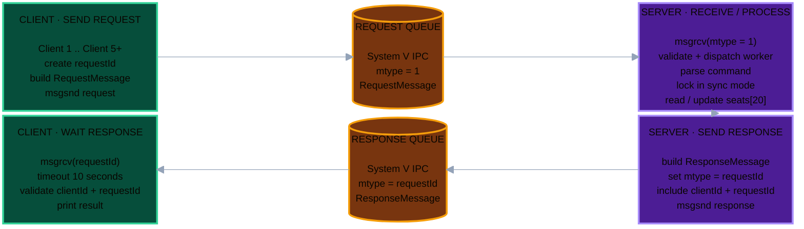

# System Architecture

ระบบจองที่นั่งนี้รันบน Linux ภายใน **Docker container เดียว** โดยมี server process และ client processes อย่างน้อย 5 ตัวที่เปิดเพิ่มด้วย `docker exec`. Client กับ server คุยกันผ่าน **System V message queues สองชุด** ส่วน worker threads และสถานะที่นั่งอยู่ภายใน server process เดียวกัน

## ภาพรวม

ภาพนี้แสดงเฉพาะ runtime ภายใน container เพื่อให้เห็นเส้นทาง IPC ชัดเจน ส่วนขั้นตอน build, `docker run` และ `docker exec` แยกอธิบายใน [Docker Build and Runtime Flow](docker-runtime-flow.md)

```mermaid
%%{init: {"theme": "base", "themeVariables": {"background": "#111827", "primaryTextColor": "#f8fafc", "lineColor": "#94a3b8", "fontFamily": "Arial"}}}%%
block-beta
    columns 5

    CLIENT_SEND["CLIENT · SEND REQUEST<br/><br/>Client 1 .. Client 5+<br/>create requestId<br/>build RequestMessage<br/>msgsnd request"]
    space
    REQUEST[("REQUEST QUEUE<br/><br/>System V IPC<br/>mtype = 1<br/>RequestMessage")]
    space
    SERVER_PROCESS["SERVER · RECEIVE / PROCESS<br/><br/>msgrcv(mtype = 1)<br/>validate + dispatch worker<br/>parse command<br/>lock in sync mode<br/>read / update seats[20]"]

    CLIENT_WAIT["CLIENT · WAIT RESPONSE<br/><br/>msgrcv(requestId)<br/>timeout 10 seconds<br/>validate clientId + requestId<br/>print result"]
    space
    RESPONSE[("RESPONSE QUEUE<br/><br/>System V IPC<br/>mtype = requestId<br/>ResponseMessage")]
    space
    SERVER_SEND["SERVER · SEND RESPONSE<br/><br/>build ResponseMessage<br/>set mtype = requestId<br/>include clientId + requestId<br/>msgsnd response"]

    CLIENT_SEND --> REQUEST
    REQUEST --> SERVER_PROCESS
    SERVER_PROCESS --> SERVER_SEND
    SERVER_SEND --> RESPONSE
    RESPONSE --> CLIENT_WAIT

    style CLIENT_SEND fill:#064e3b,stroke:#34d399,color:#ecfdf5,stroke-width:3px
    style CLIENT_WAIT fill:#064e3b,stroke:#34d399,color:#ecfdf5,stroke-width:3px
    style REQUEST fill:#78350f,stroke:#f59e0b,color:#fffbeb,stroke-width:3px
    style RESPONSE fill:#78350f,stroke:#f59e0b,color:#fffbeb,stroke-width:3px
    style SERVER_PROCESS fill:#4c1d95,stroke:#a78bfa,color:#faf5ff,stroke-width:3px
    style SERVER_SEND fill:#4c1d95,stroke:#a78bfa,color:#faf5ff,stroke-width:3px
```

องค์ประกอบทั้งหมดอยู่ภายใน Docker container เดียว กล่องสีเขียวคือ state ของ Client, สีส้มคือ System V queues สองชุดที่แยกจากกัน และสีม่วงคือ state ของ Server แถวบนแสดง request จากซ้ายไปขวา ส่วนแถวล่างแสดง response จากขวากลับมาซ้าย

### ลำดับของหนึ่ง request

ตัวอย่างเมื่อ Client 1 ส่งคำสั่ง `RESERVE 10`:

| ขั้น | ผู้ทำงาน | สิ่งที่เกิดขึ้น |
| ---: | --- | --- |
| 1 | Client 1 | สร้าง `RequestMessage` ที่มี `clientId=1`, `requestId` และ `command="RESERVE 10"` |
| 2 | Client 1 | ส่ง message เข้า request queue โดยใช้ `mtype=1` |
| 3 | Worker ตัวหนึ่ง | รับ request จากคิว แล้ว parse และ validate คำสั่ง |
| 4 | Reservation logic | โหมด `sync` ล็อก Seat 10 ก่อนตรวจและแก้สถานะ ส่วน `nosync` ข้าม lock |
| 5 | Worker | สร้าง `ResponseMessage` แล้วส่งเข้า response queue โดยใช้ `mtype=requestId` |
| 6 | Client 1 | รับเฉพาะ response ที่ตรงกับ `requestId` ของตัวเอง แล้วแสดงผล |

### แต่ละส่วนทำอะไร

| ส่วนในภาพ | สิ่งที่ใช้จริง | หน้าที่ |
| --- | --- | --- |
| Host scripts | `scripts/`, `tests/` และ Docker CLI | Build image, เริ่ม/หยุด container, เปิด client, รัน demo/load test และเก็บผลลง `results/` บน host |
| Client 1–5 | `./client <client_id>` processes | เปิดผ่าน `docker exec` ภายใน container เดียวกับ server; สามารถเปิด client เพิ่มโดยไม่ต้องสร้าง container ใหม่ |
| Request queue | System V `msgget`/`msgsnd`/`msgrcv` | รับคำสั่งจากทุก client ร่วมกัน; request ทุกอันใช้ `mtype = 1` |
| Response queue | System V message queue อีกชุด | รับคำตอบจาก workers; `mtype = requestId` เพื่อให้แต่ละคำขออ่านผลของตนเองได้ ไม่ต้องมี private queue |
| Server process | `./server <sync|nosync> <worker_count>` | เป็น process หลักของ container; กัน server ซ้ำด้วย `flock`, สร้าง queues, เปิด worker threads, ถือ seat state และลบ queues เมื่อปิดตามปกติ |
| Worker threads | C++ `std::thread` จำนวนตาม `<worker_count>` | แย่งกันรับ request จากคิวเดียว, parse/validate คำสั่ง, เรียก reservation logic และส่ง response |
| Seat state | `int seats[20]` ใน memory ของ server | `0` หมายถึงว่าง; ค่า `clientId` ที่เป็นบวกหมายถึง client นั้นจองไว้; รีเซ็ตเมื่อเริ่ม server ใหม่ |
| Seat locks | `std::mutex seatMutexes[20]` | ล็อกแยกตามที่นั่งในโหมด `sync`; โหมด `nosync` ตั้งใจไม่ใช้เพื่อสาธิต race condition |

## ทำไมใช้ container เดียวแล้วคุยกันได้

`scripts/container.sh` ใช้ Dockerfile build image แล้วเปิด container โดยให้ `./server` เป็น process หลัก เมื่อใช้ `docker exec` เปิด `./client` เพิ่ม ทุก process อยู่ใน container เดียวกัน จึงเห็น IPC namespace และ path `/ipc` เดียวกันโดยอัตโนมัติ ไม่ต้องตั้งค่า `ipc: host` หรือ mount shared volume

`ftok("/ipc", 'A')` และ `ftok("/ipc", 'B')` ใช้ path เดียวกันแต่คนละ project ID เพื่อสร้าง key ของ request/response queue. **Queue messages ไม่ได้ถูกเก็บเป็นไฟล์ใต้ `/ipc`**: ตัว queue อยู่ใน kernel ส่วน directory `/ipc` สร้างไว้ใน Dockerfile เพื่อให้ `ftok` ใช้อ้างอิง และมีไฟล์ `/ipc/server.lock` สำหรับ `flock` ป้องกันการเปิด server ซ้ำ ระบบนี้ไม่ได้ใช้ System V semaphore; ตัวป้องกัน race ของที่นั่งคือ C++ `std::mutex`

## Message ที่วิ่งในคิว

โครงสร้างจริงอยู่ใน [`src/models/message.h`](../src/models/message.h); ค่าคงที่อยู่ใน [`src/constants/constants.h`](../src/constants/constants.h)

คำสั่งที่ส่งผ่าน `command` ได้แก่ `LIST`, `STATUS <seat_id>`, `RESERVE <seat_id> [seat_id...]`, `CANCEL <seat_id> [seat_id...]` และ `QUIT`. คำสั่ง `QUIT` จบเฉพาะ client process นั้น ไม่ได้ปิด server

| Field | Request | Response |
| --- | --- | --- |
| `mtype` | `1` สำหรับทุก request | `requestId` ของ request ต้นทาง |
| `clientId` | เจ้าของคำสั่ง/ใช้ตรวจสิทธิ์ยกเลิก | ส่งกลับเพื่อยืนยันว่าตอบถูก client |
| `requestId` | เลขระบุคำขอแต่ละครั้ง | ส่งกลับเพื่อยืนยันการจับคู่ |
| `command[128]` | ข้อความคำสั่งไม่เกิน 127 bytes + NUL | — |
| `response[2048]` | — | ข้อความผลลัพธ์ + NUL; ส่งเฉพาะความยาวที่ใช้จริง |

ระบบมี **สอง shared queues** ไม่ใช่หนึ่งคิวต่อ client หรือหนึ่งคิวต่อ worker. Client มี deadline 10 วินาทีในการส่ง request/รอ response; หากรอ response จน timeout ผลของ operation อาจยังไม่แน่นอน จึงควรตรวจ `STATUS` ก่อนส่งคำสั่งซ้ำ

## ที่นั่ง, transaction และการล็อก

ทุก worker เรียก reservation logic ใน server process เดียวกัน จึงเห็น `seats[20]` ชุดเดียวกัน การจอง/ยกเลิกหลายที่นั่งจะ sort และตัด seat ID ซ้ำ ตรวจข้อมูลและสถานะของทุกที่ก่อนอัปเดต; ถ้าตรวจไม่ผ่านจะไม่เปลี่ยนที่นั่งใดของคำขอนั้น

ในโหมด `sync` worker ล็อก mutex ของที่นั่งเป้าหมายตามลำดับ seat ID และถือไว้ตลอดช่วงตรวจจนถึงอัปเดต จึงทำ `RESERVE`/`CANCEL` หลายที่นั่งแบบ all-or-nothing เมื่อมีหลาย worker แข่งกันได้; การล็อกเรียงลำดับช่วยเลี่ยง deadlock. `STATUS` ล็อกที่นั่งเดียว และ `LIST` ล็อกครบทั้ง 20 ที่นั่งเพื่ออ่าน snapshot ที่สอดคล้องกัน

ในโหมด `nosync` worker ตรวจทุกที่นั่งก่อนอัปเดต แต่ **ไม่มี mutex รับประกันผลเมื่อหลาย worker ทำพร้อมกัน**: worker อื่นอาจเห็นที่นั่งว่างพร้อมกันและจองทับกันได้ มีการหน่วงสุ่ม 50–500 ms ระหว่างตรวจและอัปเดตเพื่อทำให้ race สังเกตได้ง่ายขึ้น โหมดนี้มีไว้สำหรับการทดลอง ไม่ควรใช้ยืนยันความถูกต้องของการจองจริง

## โหมดทดลอง

สคริปต์เริ่ม container ด้วย server command ต่างกัน โดย client และ queues ยังมี topology เดิม:

| Experiment | คำสั่ง | Server command | จุดที่สังเกต |
| --- | --- | --- | --- |
| 1: Sequential baseline | `bash scripts/container.sh start sequential` | `./server sync 1` | มี worker เดียว จึงประมวลผลทีละ request |
| 2: Concurrent nosync | `bash scripts/container.sh start nosync` | `./server nosync 3` | มีสาม worker และตั้งใจไม่ล็อกเพื่อแสดง race |
| 3: Concurrent sync | `bash scripts/container.sh start sync` | `./server sync 3` | มีสาม worker พร้อม per-seat mutex |

`scripts/container.sh` ใช้ `nosync` เป็นค่าเริ่มต้น เมื่อต้องการเปลี่ยน experiment ให้ `stop` แล้ว `start` ใหม่เพื่อให้ server และสถานะใน memory เป็นชุดใหม่ ดูคำสั่งรันจริงใน [README](../README.md)

## Logs, load test และหลักฐาน

Server log ในโหมดปกติมี `[SEQ n] [Worker-x] [Client-y]` จึงตามลำดับการรับคำสั่ง, การรอ/ได้ lock และการเข้า/ออก critical section ได้ `AIRPLANE_LOG_MODE=quiet` ลด log ระดับ worker สำหรับ benchmark แต่ไม่เปลี่ยน message flow หรือ reservation logic

`./load_test` เรียก exchange เดียวกับ client และสร้างหนึ่ง thread ต่อหนึ่ง logical client ตามค่า concurrency แต่ละ thread ใช้ client ID เดิมตลอดรอบและส่งคำขอทีละรายการ โดยแบ่ง request numbers ให้แต่ละ thread อย่างแน่นอนเพื่อให้จองและยกเลิกด้วย owner เดิมได้ โปรแกรมสรุป completed, transport failures, operation outcomes, throughput และ average latency. Script `scripts/load-test.ps1` เรียก `docker exec` และเก็บ output, parameters และ server logs เป็น TXT แยกต่อรอบที่ `results/load-tests/`; demo scripts เก็บ output แยกตาม client พร้อม server logs ที่ `results/demos/`. รายชื่อไฟล์ผลลัพธ์ดูได้ใน [`results/README.md`](../results/README.md)

## แผนที่โค้ด

| Path | Responsibility |
| --- | --- |
| `src/client/` | อ่านคำสั่งจากผู้ใช้และแสดง response |
| `src/ipc/` | สร้าง/เปิด message queues, ส่งและจับคู่ message, กัน server ซ้ำ |
| `src/server/` | lifecycle ของ server, worker threads และ dispatch คำสั่ง |
| `src/reservation/` | seat state, validation, reserve/cancel และ mutex |
| `src/benchmark/` | concurrent load generator และตัวเลขผลการทดสอบ |
| `src/utils/` | parser, logger และ random delay |
| `Dockerfile`, `scripts/container.sh` | image และการเริ่ม/หยุด server container เดียว |
| `scripts/`, `tests/` | คำสั่ง demo/เก็บผล และชุดทดสอบ |
