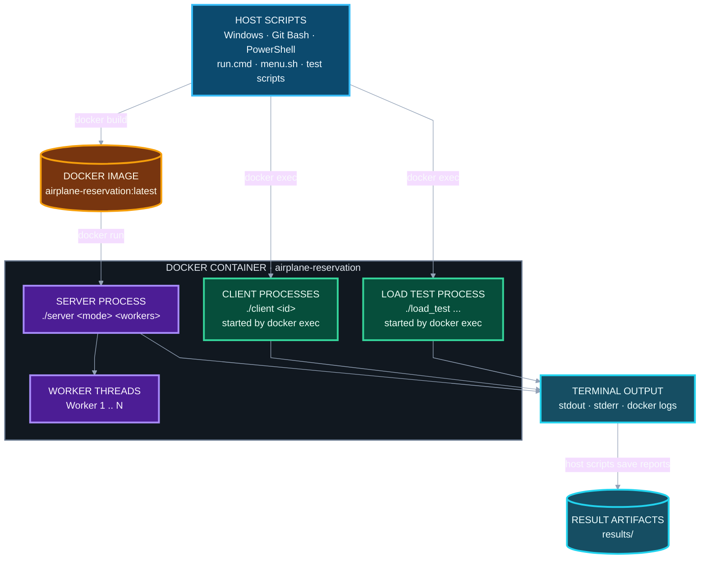
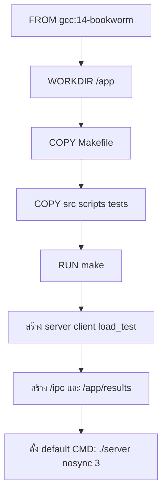
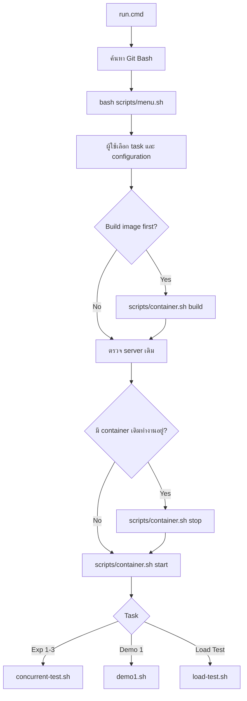
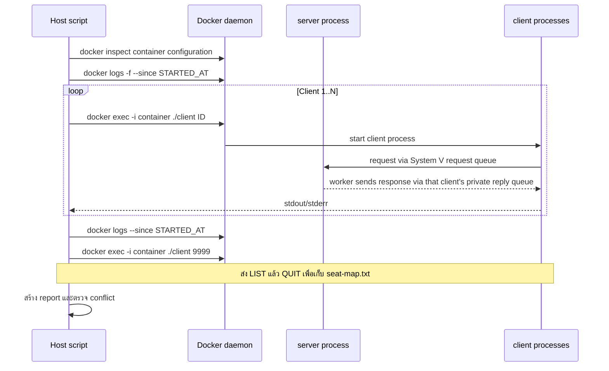

# Docker Build and Runtime Flow

เอกสารนี้อธิบายว่าเมื่อรัน TUI หรือแต่ละ script แล้ว ระบบเรียก Docker อย่างไร ภายใน image มีอะไร และแต่ละ experiment สร้าง process อะไรใน container บ้าง

## 1. ภาพรวมสั้น ๆ

ระบบใช้ Docker image เดียวและรัน server container เพียงหนึ่งตัว



`client` และ `load_test` ไม่ได้รันเป็น container แยก แต่เป็น process ใหม่ภายใน container `airplane-reservation` ผ่าน `docker exec` จึงมองเห็น System V IPC namespace เดียวกับ server ภายใน namespace นี้มี shared request queue และ private reply queues แยกตาม client ดูเส้นทางของ message ใน [System Architecture](architecture.md)

## 2. Flow เมื่อสั่ง Build image

คำสั่งหลัก:

```bash
bash scripts/container.sh build
```

ภายใน `scripts/container.sh` ขยายเป็น:

```bash
docker build -t airplane-reservation:latest <project-root>
```

### สิ่งที่ Dockerfile ทำ



ขั้นตอนจริง:

1. ใช้ Linux base image `gcc:14-bookworm`
2. ตั้ง working directory เป็น `/app`
3. คัดลอก `Makefile`, `src/`, `scripts/` และ `tests/` เข้า image
4. รัน `make` ด้วย C++17 และ pthread
5. ได้ executable ที่ `/app/server`, `/app/client` และ `/app/load_test`
6. สร้าง `/ipc` สำหรับใช้เป็น path ของ `ftok()` และสร้าง `/app/results`
7. ตั้ง default command เป็น `./server nosync 3`

### หลัง Build สำเร็จ image มีอะไร

```text
/app
├── server                 # server executable
├── client                 # interactive client executable
├── load_test              # benchmark/load generator executable
├── Makefile
├── src/
├── scripts/
├── tests/
├── build/                 # object/dependency files จาก make
└── results/

/ipc                       # token path สำหรับ ftok(); ไม่ใช่ไฟล์เก็บ message
```

ข้อความ request/response ถูกเก็บใน System V queues ของ Linux kernel ไม่ได้ถูกเขียนลง `/ipc`

> `CMD ["./server", "nosync", "3"]` เป็นเพียงค่า default ถ้ารัน image ตรง ๆ ส่วน `scripts/container.sh start` จะ override CMD ตาม experiment ที่เลือก

## 3. Flow การเริ่ม server container

คำสั่งตัวอย่าง:

```bash
bash scripts/container.sh start sync 3
```

script แปลงเป็นคำสั่งลักษณะนี้:

```bash
docker run -d --rm \
  --name airplane-reservation \
  --label org.airplane-reservation.managed=true \
  -e AIRPLANE_LOG_MODE=verbose \
  airplane-reservation:latest \
  ./server sync 3
```

ความหมาย:

| ส่วน | หน้าที่ |
| --- | --- |
| `-d` | รัน container แบบ background |
| `--rm` | ลบ container อัตโนมัติหลัง server หยุด |
| `--name airplane-reservation` | กำหนดชื่อที่ scripts ใช้อ้างอิง |
| `--label ...managed=true` | ยืนยันว่า container ถูกสร้างโดย project ก่อนอนุญาตให้ script สั่งหยุด |
| `AIRPLANE_LOG_MODE` | เลือก `verbose` หรือ `quiet` |
| `./server sync 3` | เปิด server แบบ synchronized และสร้าง 3 workers |

หลัง `docker run` script จะทำสองอย่างซ้ำจน server พร้อม:

```bash
docker inspect --format '{{.State.Running}}' airplane-reservation
docker logs airplane-reservation
```

server ถือว่าพร้อมเมื่อ log มีข้อความ `Airplane Reservation Server started`

### Mapping ของ experiment

| Experiment ที่ส่งให้ script | Server mode จริง | Workers เริ่มต้น | Command ภายใน container |
| --- | --- | ---: | --- |
| `sequential` | `sync` | 1 | `./server sync 1` |
| `nosync` | `nosync` | 3 | `./server nosync 3` |
| `sync` | `sync` | 3 | `./server sync 3` |

Experiment `sequential` บังคับให้มี worker เท่ากับ 1 ส่วน `nosync` และ `sync` รองรับ worker 1-64 ตัว

## 4. Flow เมื่อเปิด TUI

บน Windows:

```powershell
.\run.cmd
```

ลำดับการเรียก:



ฟังก์ชัน `prepare_server` ใน `scripts/menu.sh` เป็นตัวดูแล build, หยุด container เดิม และเริ่ม server ใหม่ จึงทำให้ทุก task เริ่มด้วย seat state และ message queues ชุดใหม่

## 5. Experiment 1-3: `concurrent-test.sh`

ไฟล์ `scripts/concurrent-test.sh` ตั้ง `DEMO_NAME=concurrent` แล้วโหลด implementation จาก `scripts/lib/demo.sh`

### คำสั่งจาก TUI

TUI กำหนดค่าก่อนเรียก script:

```bash
CLIENT_COUNT=<clients> \
COMMAND=<LIST|STATUS|RESERVE|CANCEL> \
SEAT_ID=<1-20> \
bash scripts/concurrent-test.sh
```

### Flow ภายใน script



แต่ละ client ถูกเปิดพร้อมกันเป็น background process ฝั่ง host โดย command จริงเป็นรูปแบบนี้:

```bash
printf 'RESERVE 10\nQUIT\n' |
  docker exec -i airplane-reservation ./client 1
```

ถ้ามี 5 clients จะเกิด `docker exec` 5 ครั้งพร้อมกัน:

```text
docker exec -i airplane-reservation ./client 1
docker exec -i airplane-reservation ./client 2
docker exec -i airplane-reservation ./client 3
docker exec -i airplane-reservation ./client 4
docker exec -i airplane-reservation ./client 5
```

ทุก process อยู่ใน container เดียวกัน แต่มี client ID และ request ID แยกกัน

### พฤติกรรมพิเศษของแต่ละ command

| Command | สิ่งที่ส่งให้แต่ละ client |
| --- | --- |
| `RESERVE` | `RESERVE <seat>` แล้ว `QUIT` |
| `STATUS` | `STATUS <seat>` แล้ว `QUIT` |
| `LIST` | `LIST` แล้ว `QUIT`; ไม่ใช้ target seat |
| `CANCEL` | Preflight ด้วย Client-1 เพื่อให้ที่นั่งมี owner ก่อน แล้วจึงส่ง `CANCEL <seat>` |

หลัง clients จบ script จะ:

1. หยุด live-log process
2. บันทึก log รอบปัจจุบันด้วย `docker logs --since ... --timestamps`
3. เปิด Client-9999 ผ่าน `docker exec` แล้วส่ง `LIST` เพื่อสร้าง `seat-map.txt`
4. อ่าน output ของ clients ทุกคนเพื่อสร้าง `report.txt`
5. ถ้า `RESERVE` มีผู้ได้ SUCCESS มากกว่าหนึ่งราย จะเขียน `seat-conflicts.txt`

ผลถูกเก็บที่:

```text
results/demos/concurrent/<UTC timestamp>/
```

## 6. Demo 1: `demo1.sh`

`scripts/demo1.sh` ใช้ implementation เดียวกับ concurrent test แต่ตั้ง `DEMO_NAME=demo1`

TUI จะเริ่ม server แบบ:

```bash
docker run ... airplane-reservation:latest ./server sync <workers>
```

Demo 1 ล็อกจำนวน clients ไว้ที่ 5 และกำหนด command plan ตายตัว

### Preflight

ก่อนเริ่ม demo script ใช้ Client-1 ตรวจว่า Seats 1-10 ว่าง:

```bash
printf 'LIST\nQUIT\n' |
  docker exec -i airplane-reservation ./client 1

printf 'STATUS 1\nQUIT\n' |
  docker exec -i airplane-reservation ./client 1

# ทำ STATUS ต่อจนครบ Seat 10
```

ถ้ามีที่นั่งใดถูกจองอยู่ script จะหยุดและแนะนำให้ restart server

### Client processes ที่ถูกเปิด

| Client | Commands ที่ส่งผ่าน stdin ของ `docker exec -i` |
| --- | --- |
| 1 | `LIST`, `RESERVE 1 2`, `STATUS 1`, `CANCEL 1`, `STATUS 2`, `QUIT` |
| 2 | `STATUS 3`, `RESERVE 3 4`, `CANCEL 4`, `STATUS 3`, `LIST`, `QUIT` |
| 3 | `RESERVE 5 6`, `LIST`, `CANCEL 5`, `STATUS 6`, `QUIT` |
| 4 | `RESERVE 7 8`, `STATUS 8`, `CANCEL 8`, `LIST`, `STATUS 7`, `QUIT` |
| 5 | `LIST`, `RESERVE 9 10`, `CANCEL 9`, `STATUS 10`, `QUIT` |

ทั้ง 5 clients ทำงานพร้อมกัน หลังจบ script จะเรียก Client-9999 เพื่อเก็บ seat map และตรวจว่าเหลือ Seat 2, 3, 6, 7 และ 10 เป็นของ Client 1-5 ตามลำดับ

ผลถูกเก็บที่:

```text
results/demos/demo1/<UTC timestamp>/
```

## 7. Load Test: `load-test.sh`

ตัวอย่าง:

```bash
bash scripts/load-test.sh 100000 1000 STATUS
```

TUI จะ build/start server ก่อน แล้ว script เรียก executable ภายใน container:

```bash
docker exec airplane-reservation \
  ./load_test 100000 1000 STATUS
```

ถ้าระบุ target seat:

```bash
docker exec airplane-reservation \
  ./load_test 100000 1000 RESERVE 10
```

### Flow

1. ตรวจว่า server container กำลังทำงานด้วย `docker inspect`
2. อ่าน `./server <mode> <workers>` จาก container configuration
3. สร้างโฟลเดอร์ผลลัพธ์บน host
4. เรียก `docker exec ... ./load_test ...`
5. ใช้ `tee` แสดงผลบน terminal และบันทึก `output.log`
6. เก็บ server logs ด้วย `docker logs --since ... --timestamps`
7. เรียก `./client 9999` ผ่าน `docker exec -i` เพื่อเก็บ seat map
8. แยก Completed, Transport Fail, Throughput และ Average Latency จาก output
9. สร้าง `report.txt`, `summary.txt` และไฟล์หลักฐานอื่น

ผลถูกเก็บที่:

```text
results/load-tests/<UTC timestamp>/
```

### Logical clients ไม่เท่ากับ Docker containers

Argument ตัวที่สองของ `load_test` คือจำนวน logical clients/concurrency ภายใน process `load_test` เดียว ตัวอย่างนี้:

```bash
./load_test 100000 1000 STATUS
```

หมายถึง `load_test` process เดียวสร้าง 1,000 threads/logical clients เพื่อส่งรวม 100,000 requests ไม่ได้สร้าง 1,000 Docker containers และไม่ได้เรียก `./client` 1,000 ครั้ง

## 8. PowerShell Load Test: `load-test.ps1`

ตัวอย่าง:

```powershell
.\scripts\load-test.ps1 100000 1000 STATUS
```

PowerShell script นี้ **ไม่ build image และไม่ start server** ผู้ใช้ต้องมี server container ทำงานอยู่ก่อน

คำสั่ง Docker หลักที่ script เรียก:

```powershell
docker inspect --format '{{.State.Running}}' airplane-reservation
docker inspect airplane-reservation
docker exec airplane-reservation ./load_test 100000 1000 STATUS
docker logs --since <started-at> --timestamps airplane-reservation
```

script ใช้ `docker inspect` ตรวจ mode, worker count และ `AIRPLANE_LOG_MODE` จาก container จริง แล้วบันทึก `output.log`, `server.log` และ `summary.txt` ลง `results/load-tests/`

PowerShell version ไม่สร้าง `report.txt` และ seat-map เหมือน Bash wrapper

## 9. Container utility: `container.sh`

| Script command | Docker command ที่ถูกเรียก |
| --- | --- |
| `container.sh build` | `docker build -t airplane-reservation:latest <root>` |
| `container.sh start <exp> <workers>` | `docker run -d --rm ... ./server <mode> <workers>` |
| `container.sh status` | `docker inspect --format '{{.State.Running}}'` |
| `container.sh mode` | `docker inspect --format '{{json .Config.Cmd}}'` |
| `container.sh workers` | `docker inspect --format '{{json .Config.Cmd}}'` |
| `container.sh exec ...` | `docker exec ... airplane-reservation <command>` |
| `container.sh logs ...` | `docker logs ... airplane-reservation` |
| `container.sh stop` | `docker stop airplane-reservation` แล้วรอจน inspect ไม่พบ container |

`stop` จะปฏิเสธ container ที่ไม่มี label `org.airplane-reservation.managed=true` เพื่อไม่ให้ script หยุด container อื่นโดยไม่ตั้งใจ

## 10. Test script: `test.sh`

```bash
bash scripts/test.sh
```

script นี้เรียก:

```bash
make test
```

`make test` รัน unit, IPC, integration, regression, script, TUI และ build tests บน environment ปัจจุบัน โดยไม่ได้เรียก Docker สำหรับชุดหลัก

ถ้าต้องการทดสอบ Docker container ให้ใช้:

```bash
make test-container
```

ซึ่งเรียก `tests/container_smoke_tests.sh` เพื่อ build image, เปิด server configurations หลายแบบ และใช้ `docker exec` ทดสอบ client/load test ภายใน container

## 11. Live logs และผลลัพธ์อยู่ที่ไหน

### Live logs

ระหว่าง concurrent test และ Demo 1:

```bash
docker logs -f --since <started-at> --timestamps airplane-reservation
```

process นี้ทำงาน background และ script อ่านไฟล์ `server-live.log` มาแสดงบน terminal แบบสด เมื่อ clients จบ script จะหยุดเฉพาะ log follower ไม่ได้หยุด server

### Results

ผลลัพธ์ถูกสร้างโดย scripts ฝั่ง host:

```text
results/
├── demos/
│   ├── concurrent/<timestamp>/
│   └── demo1/<timestamp>/
└── load-tests/<timestamp>/
```

ไม่ได้ใช้ Docker volume mount และไม่ได้คัดลอกไฟล์จาก `/app/results` ออกมาจาก container ค่า `/app/results` ใน image มีไว้รองรับการรันภายใน Linux/container แต่ wrappers ปัจจุบันบันทึกหลักฐานลง `results/` บน host โดยตรง

## 12. Flow ตอนหยุด server

จาก TUI หรือ manual command:

```bash
bash scripts/container.sh stop
```

ลำดับ:

1. `docker inspect` ตรวจ managed label
2. `docker stop airplane-reservation`
3. Docker หยุด `./server`
4. `--rm` ทำให้ Docker ลบ container อัตโนมัติ
5. script วน `docker inspect` จนชื่อ container ถูกปล่อยจริง ป้องกัน error `name is already in use` เมื่อเริ่ม experiment ถัดไปทันที

การหยุด container ไม่ลบ image `airplane-reservation:latest` และไม่ลบผลลัพธ์ที่อยู่ใน `results/`

## 13. ต้อง Build ใหม่เมื่อไร

| การเปลี่ยนแปลง | ต้อง Build image ใหม่หรือไม่ |
| --- | --- |
| แก้ `src/`, `Makefile` หรือ `Dockerfile` | ต้อง build ใหม่ |
| ต้องการ executable `server`, `client`, `load_test` เวอร์ชันล่าสุด | ต้อง build ใหม่ |
| เปลี่ยนจำนวน workers, clients, command หรือ seat | ไม่ต้อง build ใหม่; restart server/run script ใหม่พอ |
| เปลี่ยน `verbose` เป็น `quiet` | ไม่ต้อง build ใหม่; start container ใหม่ด้วย environment ใหม่ |
| แก้เฉพาะเอกสารใน `README.md` หรือ `docs/` | ไม่ต้อง build ใหม่ |
| แก้ host wrapper ใน `scripts/` | โดยทั่วไปไม่ต้อง build หาก script นั้นรันบน host แต่ TUI ตั้ง `Build image first=yes` เป็นค่าเริ่มต้นเพื่อให้ image ตรงกับ source เสมอ |
