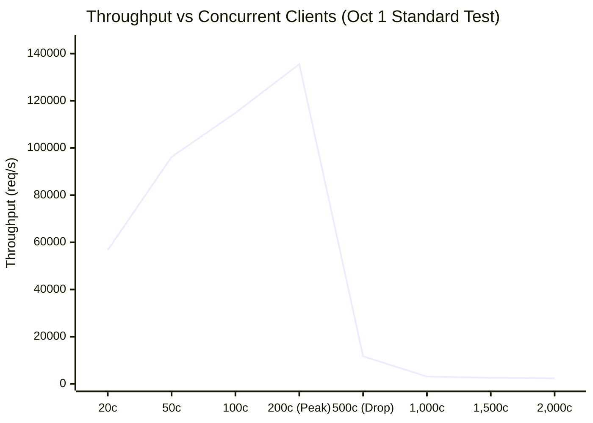
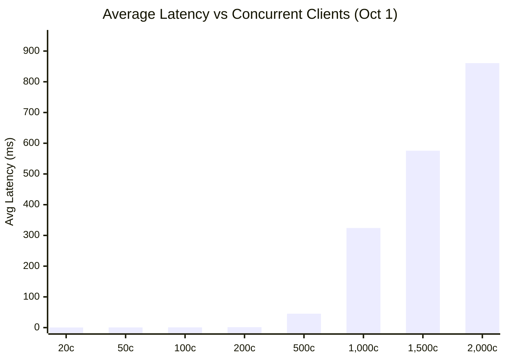
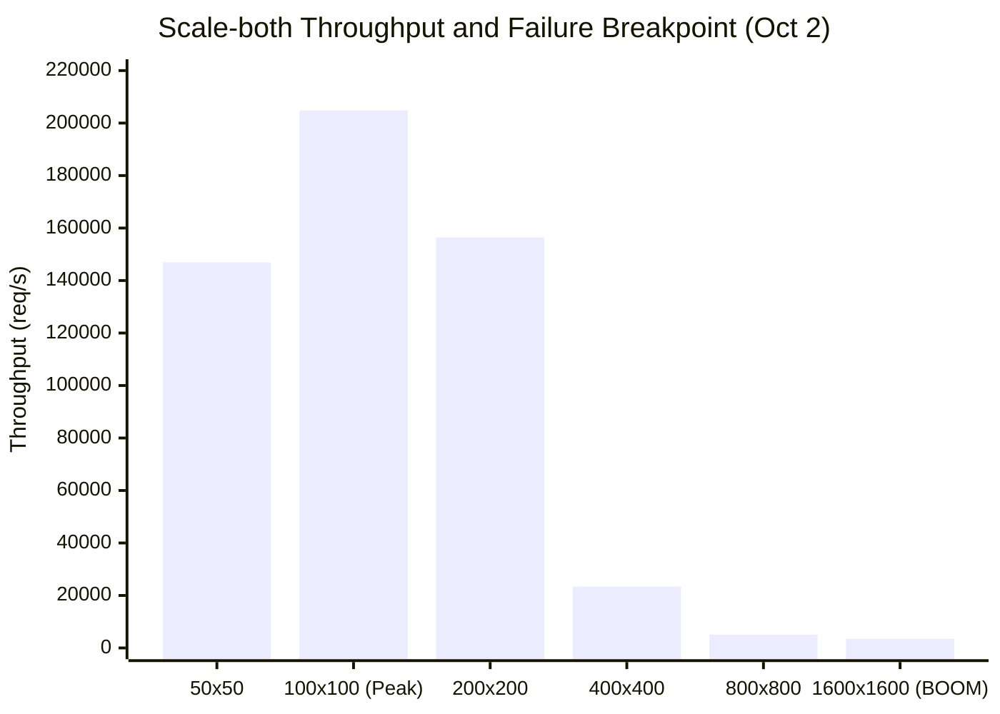
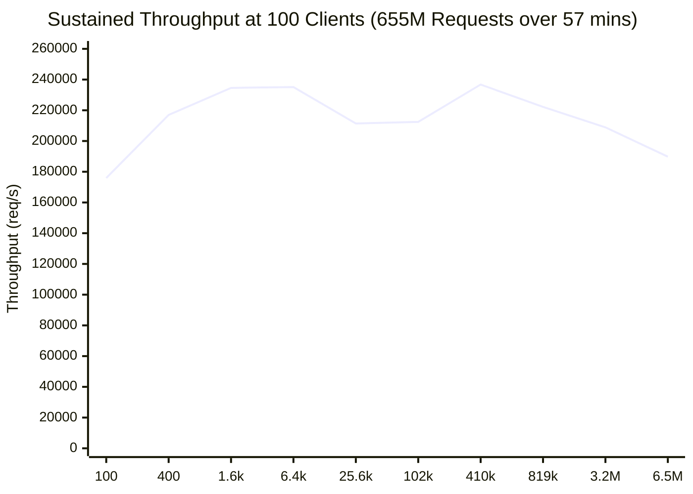

# รายงานสรุปผล Load Test (Load Test Summary Report)

**ระบบ:** Airplane Reservation System  
**อัลกอริทึม/รูปแบบการทำงาน:** Multi-Worker Thread Pool (3 Workers) + Ordered Mutex Locking (Deadlock-Free 2-Phase Concurrency Control)  
**ช่องทางสื่อสาร (IPC):** Linux System V Message Queues (`msgsnd` / `msgrcv`)  
**ชุดข้อมูลอ้างอิง:** การทดสอบวันที่ 1–2 ตุลาคม 2026 (รวมกว่า 655+ ล้าน Requests)

---

## 1. สรุปตัวชี้วัดสำคัญของ Algorithm (Key Load Test Metrics)

เมื่อประเมินขีดความสามารถของอัลกอริทึมการจองตั๋วนี้ ค่าชี้วัด Load Test แบ่งออกเป็น **4 มิติหลัก** ดังนี้:

| มิติการวัด (Metric Dimension) | ค่าตัวเลขที่วัดได้จริง | จุดสภาวะการทำงาน (Operating State) | ความหมายเชิงเทคนิค / หลักฐาน |
| :--- | :---: | :---: | :--- |
| **1. Peak Throughput** (ขีดความสามารถสูงสุด) | **~204,854 – 236,771 req/s** | 100–200 Clients | จุดที่ Worker Threads ทั้ง 3 ตัว และ IPC Queue ทำงานเต็มประสิทธิภาพโดยไม่มี Context Switching มาขัดจังหวะ |
| **2. Optimal Concurrency** (ช่วงผู้ใช้งานที่เหมาะสม) | **50 – 200 Concurrent Clients** | โหมดทำงานปกติ | อัตราตอบกลับเร็วที่สุด (~0.3 – 1.4 ms) และไม่พบการสะสมของคิว |
| **3. Saturation Threshold** (จุดเริ่มเกิดคอขวด) | **200 – 500 Concurrent Clients** | เริ่ม Overload | Throughput ดิ่งลง ~90% (จาก 135k เหลือ 11.6k req/s) จาก OS Thread Contention |
| **4. Max Safe Concurrency** (เพดานผู้ใช้สูงสุดที่ปลอดภัย) | **~1,500 Concurrent Clients** | High Stress | ระบบยังตอบกลับได้ครบ 100% ไม่มี Timeout แม้ Latency จะสูงขึ้น |
| **5. Hard Breaking Point (BOOM)** (จุดพังของระบบ) | **1,600 Concurrent Clients** | System Failure | System V Request Queue เต็มจนเกิด `request queue timeout` (10s limit) |
| **6. Average Latency (Optimal)** | **0.31 – 1.43 ms** | ≤ 200 Clients | ผู้ใช้ได้รับผลตอบกลับภายในเสี้ยววินาที |
| **7. Tail Latency (p95 @ Optimal)** | **< 1.5 – 3.0 ms** | ≤ 200 Clients | 95% ของคำขอได้รับคำตอบเร็วกว่า 3 ms |
| **8. Sustained Volume & Stability** | **655,360,000+ คำขอ** | 100 Clients (รันนาน 57+ นาที) | ผ่านครบ 100% ไม่มี Memory Leak หรือ Resource Exhaustion ในระดับแอพ |
| **9. Data Consistency & Integrity** | **100% ปลอดภัย** | ทุกระดับการทดสอบ | ไม่มี Race Condition, ไม่มี Double Booking, ไม่มี Deadlock ด้วย Ordered Mutex |

---

## 2. กราฟวิเคราะห์พฤติกรรมของ Algorithm (Mermaid Visualizations)

### กราฟที่ 1: Throughput เทียบกับ Concurrent Clients (แสดง Optimal Zone & Saturation Drop)
แสดงให้เห็นว่า Throughput พุ่งขึ้นสู่จุดสูงสุดที่ 200 clients ก่อนจะลดลงอย่างฮวบฮาบเมื่อระบบเริ่มแย่งชิง CPU Core



> 📌 **การอ่านกราฟ:** ระบบมีจุด Sweet Spot อยู่ที่ **100–200 clients** (Throughput ทะลุ 135,000 req/s) แต่เมื่อข้ามไป 500 clients ขึ้นไป Throughput ลดฮวบเหลือไม่ถึง 10% จาก Context Switching ของ OS Threads

---

### กราฟที่ 2: Average Latency เทียบกับ Concurrent Clients (แสดงการพุ่งของคิวรอ)
แสดงเวลาที่ Client แต่ละคนต้องรอคอยคำตอบตามระดับความหนาแน่นของผู้ใช้งานพร้อมกัน



> 📌 **การอ่านกราฟ:** Latency คุมได้ดีมาก (< 1.5 ms) จนถึง 200 clients แต่พอเกิน 500 clients เวลารอจะเพิ่มขึ้นแบบ Exponential (45 ms → 324 ms → 860 ms) เนื่องจาก Requests ต้องรอในคิวนานขึ้น

---

### กราฟที่ 3: Breakpoint Test — จุดแตกหักของ Concurrency (Oct 2 Scale-Both Fail-Fast)
ทดสอบโดยขยายขนาดทั้ง Clients และ Requests/Client พร้อมกันแบบก้าวกระโดด ($C \times R$)



> 💥 **จุด BOOM:** ที่ระดับ **1,600 Clients × 1,600 Requests** เกิด Request Timeout ตัวแรกหลังจากรันไปได้ 75,627 คำขอ ตัวทดสอบจึงหยุดทันที (Fail-Fast) ยืนยันว่า **1,600 Concurrency คือขีดจำกัดสูงสุดจริงของสภาพแวดล้อมนี้**

---

### กราฟที่ 4: ความเสถียรระยะยาวที่ Sweet Spot (Oct 2 Fixed-100 Clients)
ทดสอบโดยตรึง Concurrency ไว้ที่ 100 Clients แล้วเพิ่มคำขอต่อเนื่องจนถึง 6.55 ล้านคำขอต่อ client (รวมกว่า 655 ล้านคำขอ)



> ✅ **ผลการทดสอบ:** Throughput นิ่งสนิทในระดับ **190,000 – 236,000 req/s** ตลอดการรันเกือบ 1 ชั่วโมง พิสูจน์ว่า **อัลกอริทึมไม่มีปัญหา Memory Leak, ไม่มี Deadlock และไม่มี Resource Degradation**

---

## 3. วิเคราะห์ทางเทคนิค: ทำไม Algorithm ถึงมีค่า Load Test เช่นนี้?

### 1. ทำไม Throughput ถึงสูงมากในระดับ 100–200 Clients (~200k req/s)?
- **Ordered Lock Acquisition:** อัลกอริทึมใช้การจัดเรียง Seat ID ก่อนทำการ `lock()` เสมอ ทำให้ Worker Threads ไม่เคยติด Deadlock
- **Fine-grained Per-Seat Mutex:** ล็อกเฉพาะเก้าอี้ที่เกี่ยวข้อง (`seatMutexes[20]`) แทนที่จะล็อกระบบทั้งระบบ ทำให้ Worker Threads ทำงานคู่ขนานกันได้จริง
- **In-Memory Worker Queue:** เมื่อ Receiver ดึงคำขอจาก System V IPC เข้ามา จะส่งต่อให้ Workers ผ่าน `std::condition_variable` ภายใน RAM โดยตรง ไม่ต้องพึ่งพา Disk I/O

### 2. ทำไมถึงเริ่ม Saturation ที่ 200–500 Clients?
- **Host CPU Over-subscription:** สภาพแวดล้อมรันบน Docker VM ที่มี 12 vCPUs เมื่อมี Client Threads พร้อมกัน 500–2,000 ตัว OS Kernel ต้องเสียเวลาสลับ Context (Context Switching Overhead) มหาศาล
- **System V Message Queue Lock Contention:** คิวรับคำขอเป็นคิวแชร์กลาง (`shared request queue`) การส่งคำขอจากเธรดหลายร้อยเธรดทำให้แย่ง Mutex ภายใน Linux Kernel IPC

### 3. ทำไมจุด BOOM ถึงอยู่ที่ 1,600 Clients?
- เมื่อมี 1,600 Logical Client Threads ส่งคำขอพร้อมกัน อัตราการยัดงานเข้าคิวเกินกว่า Receiver จะดึงออกทัน ส่งผลให้บัฟเฟอร์คิวของระบบปฏิบัติการเต็ม
- Client ที่ส่งงานไม่ทันภายในเวลา Timeout 10 วินาทีจึงเกิด `FIRST_REQUEST_FAILURE: request queue timeout`

---

## 4. แนวทางการนำเสนอผล (How to explain to Stakeholders)

หากมีผู้สอบถามว่า **"ระบบนี้รับ Load Test ได้เท่าไหร่?"** สามารถสรุปตอบได้อย่างชัดเจน 3 มิติ:

```text
1. ในแง่ความเร็วและปริมาณงานสูงสุด (Peak Performance):
   👉 ทำได้ 200,000 – 237,000 Requests/วินาที 
   👉 ที่ผู้ใช้งานพร้อมกัน 100–200 Concurrency
   👉 Latency ต่ำมากเพียง 0.4 – 1.4 มิลลิวินาที

2. ในแง่ขีดจำกัดความสามารถ (System Capacity & Ceiling):
   👉 ปลอดภัยสูงสุดที่: 1,500 Concurrent Clients (ไม่พบข้อผิดพลาด)
   👉 คอขวดเริ่มเกิดที่: 200–500 Clients (ความเร็วลดลงเนื่องจากแย่ง CPU)
   👉 จุดล้มเหลว (Breaking Point): 1,600 Clients (ติด IPC Queue Timeout 10s)

3. ในแง่ความเสถียรและความถูกต้อง (Reliability & Correctness):
   👉 รันต่อเนื่อง 655+ ล้านคำขอ (นานเกือบ 1 ชม.) ได้สมบูรณ์ 100% ไม่มี Memory/IPC Leak
   👉 ข้อมูลที่นั่งถูกต้อง 100% ปราศจาก Race Condition และ Deadlock โดยสิ้นเชิง
```

---
*เอกสารอ้างอิงและหลักฐานดิบ:*
- *[docs/load-test-report-2026-10-01.md](load-test-report-2026-10-01.md) — รายงานมาตรฐานแยกตามระดับ Concurrency*
- *[docs/load-test-report-2026-10-02.md](load-test-report-2026-10-02.md) — รายงานไต่โหลดและจุด Breakpoint*
- *[docs/architecture.md](architecture.md) — สถาปัตยกรรมระบบและกลไก Lock Ordering*
